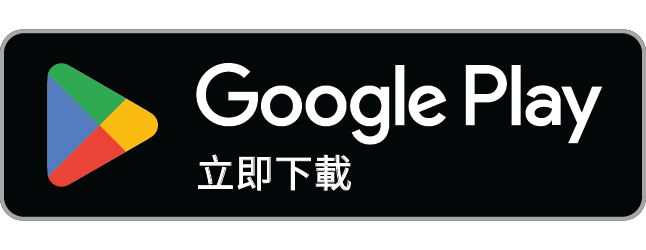

  

<h1 align="center">Resonance（共振）</h1>

  <strong>用故事回應故事</strong> 
  一個用故事卡片彼此交流的地方：回應不是按讚，而是另一段故事

  
  &nbsp;
  

  <a href="https://resonance.channel">resonance.channel</a> ·
  <a href="README.md">English</a> ·
  <a href="CONTRIBUTING.md">參與貢獻</a> ·
  <a href="SECURITY.md">回報資安問題</a> ·
  <a href="LICENSE">MIT 授權</a>

---

這是英文 [README](README.md) 的中文摘要；開發相關的完整說明以英文版和 [CLAUDE.md](CLAUDE.md) 為準。

## 共振是什麼？

在共振，你把一段人生寫成一張卡片：標題、故事、也許一張照片。讀到觸動你的卡片時，你不是按一顆愛心，而是寫一張自己的卡片來「共振」它。兩張卡片從此連在一起，你們也成為彼此的連結。

網站在 [resonance.channel](https://resonance.channel)，也有 iPhone 與 Android App，介面支援繁體中文與英文。公開的卡片不用帳號就能閱讀。

## 為什麼做共振？

多數社群量的是注意力：讚數、觀看、停留時間。被量的東西就會被優化，最後變成表演。共振押的是相反的方向：只獎勵有成本的真誠，也就是書寫。

- **共振，不是按讚。** 公開回應一張卡片的唯一方式是寫另一張卡片。沒有讚數，也沒有公開留言區，沒有人需要在別人的故事底下表演。
- **三種回應，各有對象。** 收藏是對自己說（私人、不計數）；小紙條是對作者說（只有作者讀得到的信）；共振是對世界說（寫一張自己的卡片）。
- **私訊要用故事換來。** 沒有開放的收件匣。你公開共振某人的卡片，或作者回覆了你的小紙條，你們才成為連結，連結之間才能私訊。每段對話都從一個故事開始，而不是「嗨，在嗎」。共振刻意不是交友 App。
- **每張卡片都能匿名。** 帳號是真實的，但任何一張卡片都可以匿名發布：不掛名、不出現在個人頁，伺服器也不會告訴任何人作者是誰。
- **AI 是鏡子，不是裁判。** 發布前，共振會告訴你它在草稿裡讀到的核心體悟；推薦會附上理由，而且只依據你寫了什麼，不看你點了什麼、看了多久。永遠不顯示分數。
- **安心的空間。** 每張卡片、每個人、每段訊息都能檢舉，任何人都能封鎖。沒有廣告，不追蹤你。可以下載你寫的一切，也可以刪除帳號。

完整的想法寫在 [docs/product-design-principles.md](docs/product-design-principles.md)。

## 給誰用？

- **寫真實人生的人**：想把一個轉折、一點領悟、一段安靜的回憶寫下來，並被同樣認真地回應。
- **寧可回應、不只按讚的讀者**。
- **想參與開發的人**：共振是開源專案，一套產品、三個平台（Next.js 網站、SwiftUI 與 Jetpack Compose App），共用一個有版本的 API，介面的手繪感在執行期由程式生成。

## 下載

- **iPhone**：[App Store](https://apps.apple.com/tw/app/resonance/id6817604797)
- **Android**：[Google Play](https://play.google.com/store/apps/details?id=com.resonance.stories)
- **網頁**：[resonance.channel](https://resonance.channel)。用手機打開 [resonance.channel/download](https://resonance.channel/download) 會直接前往對應的商店。

## 開發與貢獻

- 本機開發（Firebase 模擬器、種子資料、`npm run dev:emulator`、兩個 App）：見英文 README 的 [Getting started](README.md#getting-started)
- 參與貢獻的方式（分支與 worktree、必須附測試、中英文字串、設計系統規則、PR 檢查清單）：見 [CONTRIBUTING.md](CONTRIBUTING.md)
- 較早的中文架構說明：[docs/ARCHITECTURE.zh-TW.md](docs/ARCHITECTURE.zh-TW.md)

## 資安問題

請不要在公開的 issue 回報漏洞，請寄信到 **support@resonance.channel**，細節見 [SECURITY.md](SECURITY.md)。

## 授權

程式碼以 [MIT 授權](LICENSE) 釋出（Copyright (c) 2026 Resonant-Jury）。授權範圍只包含程式碼，不包含 **Resonance／共振的名稱、波浪標誌與 App 圖示**：請不要用在你自己的產品上，發布分支版本時請換上自己的名稱與圖示。字型、旗幟與商店徽章來自第三方，依其各自的條款使用，見 [THIRD_PARTY_NOTICES.md](THIRD_PARTY_NOTICES.md)。
