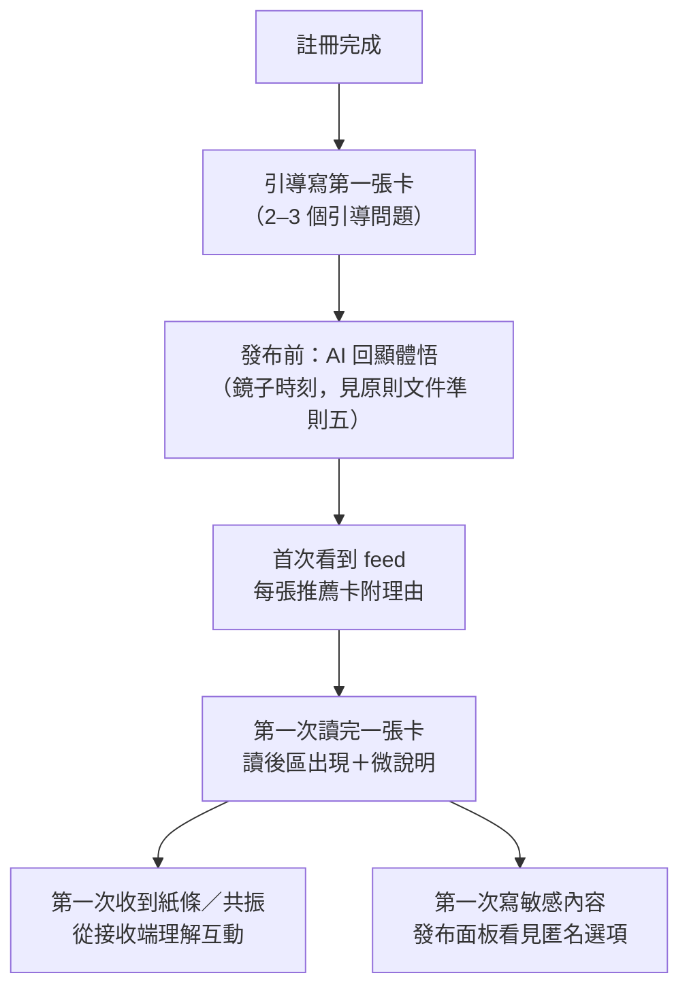

# UX / User Flow 設計規格

> 本文件記錄「三層回應」（收藏／私下回應／共振）與相關 onboarding、匿名發布的 UI 與 User Flow 設計，供後續開發參考。
> 產品層級的定位與哲學見 [product-design-principles.html](./product-design-principles.html)。
>
> **狀態標記**：✅ 已實作（現況）／🚧 待開發提案。文中的元件與檔案路徑，✅ 者為實際位置，🚧 者為建議位置。

---

## 0. 兩條總綱

所有畫面與流程設計，用這兩把尺檢驗：

1. **每個畫面只回答一個問題：「現在最該做的一件事是什麼」。** 三個互動功能不等於三顆並排等重的按鈕——用「層級」與「時機」化解選擇負擔。
2. **不做教學頁。介面自己教**：命名與隱喻承擔八成教學；微說明出現在第一次使用的當下與手邊；空狀態即教材；別人的共振卡是共振最好的示範。如果一顆按鈕需要 tooltip 才能懂，該改的是按鈕的名字。

---

## 1. 卡片頁與「讀後區」

### 1.1 版面節奏（🚧 調整現有卡片頁）

閱讀的當下不該有任何回應壓力。卡片頁由上而下的節奏：

```
┌──────────────────────────────┐
│  卡頭（作者／匿名、標題、插圖）      │
│                              │
│  故事本文（乾淨，無互動元素）        │   ← 唯一例外：收藏小圖示可常駐角落
│                              │
├──────────────────────────────┤
│  ◆ 讀後區（捲到文末才出現）         │
│                              │
│    [ 共振 ]  ← 唯一主按鈕          │
│    寄一張小紙條給作者 ← 文字連結     │
│    ⛉ 收藏 ← 安靜的圖示            │
│                              │
├──────────────────────────────┤
│  共振卡串（ResonanceCards）      │
└──────────────────────────────┘
```

這個節奏本身就在傳達價值觀：**先把故事讀完，再決定要說什麼**。讚可以在讀之前按，共振不行。

### 1.2 三個動作的視覺層級

| 動作 | 形態 | 視覺重量 | 理由 |
| --- | --- | --- | --- |
| **共振** | `OrganicButton` primary（維持現況 ✅） | 最重、最漂亮 | 平台核心儀式，值得最有份量的視覺 |
| **私下回應（小紙條）** | 一行文字連結，不是按鈕 🚧 | 次要，像溫柔的旁註 | 低成本、私密，不該搶走共振的地位 |
| **收藏** | 書籤小圖示 🚧 | 最安靜，可常駐卡片角落 | 零風險零後果，不需要解釋成本 |

圖示語彙（沿用手繪 SVG 風格，走 `atoms/Icon`）：共振＝同心圓波紋（現有 `wave` ✅）、小紙條＝信封 🚧、收藏＝書籤 🚧。

### 1.3 讀後區的狀態機

現有 `CardViewerActions`（[src/components/molecules/CardDetail/CardViewerActions.tsx](../src/components/molecules/CardDetail/CardViewerActions.tsx)）已處理部分狀態，擴充如下：

| 訪客狀態 | 共振 | 小紙條 | 收藏 |
| --- | --- | --- | --- |
| 未登入 | 顯示，點擊導向 `/signin`（✅ 現況行為） | 顯示，點擊導向 `/signin` | 顯示，點擊導向 `/signin` |
| 已登入，非作者 | primary；已共振過則轉為 outline「修改」（✅） | 顯示 | 顯示，已收藏為實心 |
| 作者本人 | 隱藏（✅） | 隱藏 | 隱藏（收藏自己的卡無意義） |

### 1.4 元件規劃

- 🚧 `molecules/CardDetail/ReadAfterArea.tsx` — 讀後區容器：包住現有 `CardViewerActions` ＋ 新的紙條入口、收藏鈕，統一排版與進場時機（進入 viewport 才淡入，`IntersectionObserver`）。
- ✅ `CardViewerActions` 保持職責不變（共振按鈕＋行內 `CardEditor`）。
- 🚧 `molecules/NoteComposer/` — 小紙條編輯器（見 §2.2）。
- 🚧 `atoms/BookmarkButton/` — 收藏切換鈕。

---

## 2. 三個互動的規格

### 2.1 收藏 🚧

- **行為**：純私人。不顯示計數、不通知作者、不進推薦訊號（Not-Doing List）。
- **入口**：卡片角落常駐小圖示＋讀後區內一份。點擊即切換，無確認步驟。
- **收藏夾**：放在 `me` 頁新增一個分頁／區塊。
- **資料模型**：`users/{uid}/bookmarks/{cardId}`：`{ cardId, createdAt }`。owner-only 讀寫（Firestore rules）。
- **空狀態即教材**（收藏夾空時）：
  > 讀到捨不得忘記的故事時，按下書籤——它們會安靜地待在這裡，只有你看得到。

### 2.2 私下回應（小紙條）🚧

- **定位**：對作者說的話。沒有觀眾、不公開、不計數、不進推薦訊號。
- **入口**：讀後區的文字連結「寄一張小紙條給作者」。
- **編輯器**：輕量行內面板（`Panel`），單一多行輸入框＋送出鈕。不是完整 `CardEditor`——形式的輕，就是門檻的低。
- **微說明**（第一次使用，輸入框正下方一行）：
  > 這段話只有作者看得到。
- **升級路徑（紙條 → 共振）**：輸入超過門檻（建議：字數 > 200）時，在輸入框下方輕輕出現一行（不打斷、不彈窗）：
  > 這段話想寫成一張共振卡嗎？ → 點擊將內容帶入共振編輯器
- **作者接收端**：通知中心新類型 `note`。開啟後顯示紙條內容，並附一顆回應動作——這是共振的邀請機制：
  > 回覆一句話／「這段經驗我很想聽，願意寫成卡片嗎？」（一鍵邀請）
- **資料模型**：`notes/{noteId}`：`{ cardId, fromUid, toUid, text, createdAt, readAt }`。
  rules：`create` 限 `fromUid == auth.uid` 且非卡片作者本人；`read` 限 `toUid`／`fromUid`；不可 `list` 他人紙條。
- **防濫用**：同一人對同一張卡的紙條設頻率上限；被連結封鎖者不可寄送（沿用 connection 機制的信任模型）。

### 2.3 共振（✅ 主流程已存在，🚧 三個增強）

現況：點擊展開行內 `CardEditor`，標題以原卡標題預填，發布後建立 `referenceCardId` 引用並通知原作者。保持不動。增強：

1. **AI 起頭** 🚧：原卡的體悟簽名（`card.signature.coreInsight`，寫入端已萃取 ✅）作為編輯器的引導語：
   > 這張卡片的體悟是「{coreInsight}」。你有過類似、或完全相反的經驗嗎？

   共振的門檻不在「要寫字」，在「面對空白編輯器不知從何說起」——我們手上剛好有解決它的素材。
2. **回聲（短共振）** 🚧：明確允許三五句話的共振卡。編輯器不設最低字數；UI 文案避免暗示「要寫一篇文章」。
3. **降級路徑（共振 → 紙條）** 🚧：共振編輯器內提供安靜的出口：
   > 還不想公開？把這段話寄給作者就好。 → 內容帶入紙條編輯器

**升降級互通是刻意設計**：當選錯的成本趨近於零，使用者不需要在動作前理解全部差異——可逆性是最好的防呆，也是最好的教學。

---

## 3. 微說明系統（just-in-time hints）🚧

取代教學頁的機制。原則：

- **就地、行內、不打斷**。永遠不是 modal、不是浮層導覽、不是遮罩式 walkthrough。說明出現在使用者視線已經在的地方、他正要做那件事的時刻。
- **漸進揭示之後要漸進收合**：每則微說明顯示前 N 次（預設 3 次），之後永久收起。老使用者的介面應該越來越安靜。
- **實作**：`lib/hints.ts` — `useHint(key): { visible, dismiss }`。已見次數存 `localStorage`（key: `hint:{name}`），登入使用者同步到 user doc 的 `hintsSeen` map（換裝置不重看）。

初始微說明清單：

| key | 位置 | 文案 |
| --- | --- | --- |
| `note-privacy` | 紙條輸入框下方 | 這段話只有作者看得到。 |
| `resonance-becomes-card` | 共振編輯器上方 | 你的回應會成為一張自己的卡片。 |
| `feed-reason` | feed 第一張推薦卡的理由旁 | 你寫下的體悟，決定你會遇見哪些故事。 |
| `anonymous-publish` | 發布面板匿名切換旁 | 匿名卡不會出現在你的個人頁。 |

---

## 4. 空狀態文案（空狀態即教材）🚧

空狀態是使用者主動好奇時才看到的，注意力品質遠高於強制導覽。

| 畫面 | 文案方向 |
| --- | --- |
| 收藏夾（空） | 見 §2.1 |
| 通知中心（空） | 當有人共振你的卡片、或寄來一張小紙條，會出現在這裡。 |
| 個人頁（無卡片） | 你的第一張卡片，會成為這個世界為你排列的起點。→ CTA：寫下一個故事 |
| feed（無個人化推薦） | 導向引導寫卡流程（見 §5），不顯示「沒有內容」。 |

---

## 5. 功能沿旅程揭露（onboarding 不是一個頁面，是一條路徑）

每個節點只教一件事，教學搭在使用者本來就會經過的時刻上：



| 旅程時刻 | 使用者學到什麼 | 依賴 |
| --- | --- | --- |
| 註冊 → 引導寫第一張卡 🚧 | 卡片是基本單位；AI 是鏡子 | 引導問題流程；簽名回顯 UI |
| 首次 feed ✅/🚧 | 「我寫什麼決定我看什麼」 | 推薦 API 已回傳 `reason` ✅；feed UI 顯示理由 🚧 |
| 第一次讀完卡 🚧 | 三個互動＋各一行微說明 | 讀後區（§1） |
| 第一次收到紙條／共振 🚧/✅ | 從最溫暖的方向理解功能 | 通知類型擴充 |
| 第一次發布敏感內容 🚧 | 匿名選項存在 | 發布面板（§6） |

**冷啟動即宣言**：推薦畫像從「你寫過什麼」建立，沒寫過卡就沒有個人化 feed（`recommendFeed` 回傳 `[]` ✅）。這不是要修的缺陷——註冊後的第一件事不是滑 feed，而是被陪著寫出第一張卡。

**共振的最佳教學是別人的共振卡**：`ResonanceCards` ✅ 已把共振關係渲染在卡片頁。後續迭代方向 🚧：強化「這張卡回應了那張卡」的視覺敘事（引用線索、來源卡的醒目度），它同時是功能、教學與社會證明。

---

## 6. 匿名發布 Flow 🚧

- **位置**：發布面板內，不藏在設定頁。發布瞬間正是作者猶豫「要不要掛名」的時刻。
- **形式**：一個切換「以匿名發布」＋**所見即所得預覽**——切換時直接顯示卡頭會長什麼樣子（handle＋頭貼 vs 匿名樣式）。看到即理解，不寫說明文字。
- **單一畫面鐵律**：發布面板正在累積內容（可見性、匿名、AI 體悟回顯）——全部收在一個畫面完成，不做多步精靈。發布是情緒最飽滿也最脆弱的時刻，多餘步驟直接折損發布率。

發布面板資訊架構（由上而下）：

1. AI 體悟回顯（鏡子；只顯示 `coreInsight`，**永不顯示分數**）
2. 可見性（public / connections / private）
3. 以匿名發布（切換＋卡頭預覽）
4. 發布鈕

**資料模型與工程注意**：

- `Card` 增加 `anonymous: boolean`。
- 匿名卡渲染：卡頭不掛 handle、不連個人頁；不出現在作者的公開個人頁（自己看自己的 `me` 頁仍可見，標記匿名徽章）。
- 推薦系統：匿名卡向量照常進作者自己的畫像（私人內容本就只影響本人推薦 ✅）；但候選池記錄含 `authorId`——**「共振作者加分」等 join 路徑、以及 API 回應中的作者欄位，必須確保不會間接洩露匿名卡作者**。修改 feed／card API 時把這條當 checklist。
- 紙條與共振通知照常送達匿名卡作者（通知本身是私人的）。

---

## 7. 文案總表（zh-TW，i18n key 建議）

| key | 文案 |
| --- | --- |
| `card.note.entry` | 寄一張小紙條給作者 |
| `card.note.hint` | 這段話只有作者看得到。 |
| `card.note.upgrade` | 這段話想寫成一張共振卡嗎？ |
| `card.note.sent` | 紙條寄出了。 |
| `card.resonance.hint` | 你的回應會成為一張自己的卡片。 |
| `card.resonance.downgrade` | 還不想公開？把這段話寄給作者就好。 |
| `card.resonance.aiPrompt` | 這張卡片的體悟是「{coreInsight}」。你有過類似、或完全相反的經驗嗎？ |
| `card.bookmark.add` / `.remove` | 收藏／取消收藏 |
| `me.bookmarks.empty` | 讀到捨不得忘記的故事時，按下書籤——它們會安靜地待在這裡，只有你看得到。 |
| `notifications.empty` | 當有人共振你的卡片、或寄來一張小紙條，會出現在這裡。 |
| `notifications.note.replyInvite` | 這段經驗我很想聽，願意寫成卡片嗎？ |
| `publish.anonymous.toggle` | 以匿名發布 |
| `publish.anonymous.hint` | 匿名卡不會出現在你的個人頁。 |
| `feed.reason.hint` | 你寫下的體悟，決定你會遇見哪些故事。 |

（英文版對應補進 `src/messages/en.json`，隱喻沿用：note → "a little note"、resonance → "resonate"。）

---

## 8. 開發切分建議（相依順序）

1. **讀後區重構**（§1）——收攏現有共振按鈕，建立三動作的層級容器。無新資料模型，純 UI。
2. **收藏**（§2.1）——資料模型最簡單，先驗證讀後區的互動節奏。
3. **微說明系統**（§3）——收藏／紙條上線前就緒，之後所有功能共用。
4. **小紙條**（§2.2）——含通知類型擴充與 rules。
5. **升降級互通＋AI 起頭**（§2.2–2.3）——依賴紙條與共振編輯器都已就位。
6. **匿名發布**（§6）——動到 Card 模型與多處渲染路徑，獨立一輪並過一次洩露 checklist。
7. **引導寫首卡＋feed 理由顯示**（§5）——onboarding 收尾。

每一步都保持「上線後介面仍然只有一個主動作」的檢查：任何時候卡片頁的視覺焦點都應該是共振，其他一切安靜。
